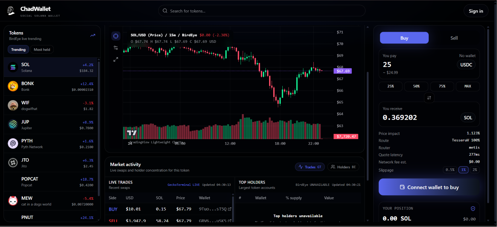

# ChadWallet

**A high-fidelity Solana wallet and trading terminal for fast-moving token markets.**

[Live product](https://chad-solana-swap-v2.vercel.app) |
[One-page project summary](output/pdf/ChadWallet-One-Pager.pdf) |
[Android app](https://play.google.com/store/apps/details?id=xyz.chadwallet.www) |
[iOS app](https://apps.apple.com/us/app/chadwallet/id6757367474)

[](https://chad-solana-swap-v2.vercel.app/trade/So11111111111111111111111111111111111111112)

ChadWallet is a three-day founding-engineer take-home built against the quality
bar of fomo.family. It pairs a cinematic, responsive landing experience with a
functional Solana trading workspace powered by live market data, embedded wallet
infrastructure, token search, charting, portfolio controls, deposits, and
Jupiter swap routing.

## Reviewer Quick Start

1. Open the [live landing page](https://chad-solana-swap-v2.vercel.app).
2. Select any token in the top or bottom live ticker.
3. Search by token name, symbol, or Solana mint address.
4. Sign in with Google or a supported wallet through Privy.
5. Review live quotes, routes, holders, trades, positions, and deposit controls.

Apple sign-in remains intentionally unconfigured because production Sign in with
Apple requires paid Apple Developer credentials.

## Assignment Coverage

| Requirement                                | Implementation                         |
| ------------------------------------------ | -------------------------------------- |
| ChadWallet branded landing page            | Complete                               |
| Official Android and iOS links             | Complete                               |
| Privy Google and wallet authentication     | Complete                               |
| Solana support                             | Complete                               |
| Live rotating token banners                | Complete                               |
| Banner-to-trading navigation               | Complete                               |
| Left: live token discovery                 | Complete                               |
| Middle: token data, chart, holders, trades | Complete                               |
| Right: buy/sell, route, wallet position    | Complete                               |
| BirdEye market integration                 | Complete, with live provider fallbacks |
| Alchemy Solana RPC                         | Complete                               |
| Jupiter quotes and transaction flow        | Complete                               |
| Supabase trade-intent persistence          | Complete                               |
| Cloudflare market-data edge worker         | Complete                               |
| Vercel production deployment               | Complete                               |

## Product Highlights

- **High-fidelity landing experience:** responsive ChadWallet branding,
  scroll-driven depth, optimized visual assets, app-store calls to action, and
  real token tickers.
- **Universal Solana token search:** live Jupiter token discovery with token name,
  symbol, and mint-address lookup.
- **Live market data:** BirdEye is the primary provider, with Jupiter,
  GeckoTerminal, DexScreener, and Solana RPC fallbacks where coverage is sparse
  or rate-limited.
- **Professional charting:** responsive candlesticks, volume, interval controls,
  price/market-cap modes, and TradingView widget support for listed assets.
- **Embedded wallet workflow:** Privy authentication, Solana wallet controls,
  address copy, deposits, transfers, account management, and wallet export entry
  points.
- **Jupiter execution path:** live quotes, route metadata, transaction creation,
  signing handoff, submission, confirmation polling, and downloadable receipts.
- **Independent workspace scrolling:** token discovery, chart/activity, and
  trading controls remain usable without losing context.

## Architecture

```text
Browser
  |-- Next.js App Router UI
  |-- Privy authentication + embedded Solana wallet
  |-- Cloudflare Worker (optional cached GET /api/market/* edge)
  `-- Vercel API routes
      |-- BirdEye / Jupiter / GeckoTerminal / DexScreener
      |-- Alchemy Solana RPC
      |-- Jupiter order and execution APIs
      `-- Supabase trade-intent persistence
```

Market endpoints return an explicit `live`, `cached`, or `unavailable` state.
The UI does not fabricate candles when a provider cannot supply real data.

## Technology

- Next.js 16 App Router and React 19
- Tailwind CSS 4
- Privy
- Solana Kit and Alchemy RPC
- BirdEye Data API
- Jupiter Tokens and Swap APIs
- GeckoTerminal and DexScreener fallbacks
- TradingView Lightweight Charts
- Supabase
- Cloudflare Workers
- Vercel

## Local Development

Requirements:

- Node.js 24
- npm 10 or newer

```bash
git clone https://github.com/Flamki/chad-solana-swap-v2.git
cd chad-solana-swap-v2
npm install
copy .env.example .env.local
npm run dev
```

Open `http://localhost:3000`.

## Environment

The application degrades gracefully when optional providers are not configured.
Use `.env.example` as the source of truth.

```bash
# Public browser configuration
NEXT_PUBLIC_PRIVY_APP_ID=
NEXT_PUBLIC_PRIVY_CLIENT_ID=
NEXT_PUBLIC_SUPABASE_URL=
NEXT_PUBLIC_SUPABASE_ANON_KEY=
NEXT_PUBLIC_EDGE_API_URL=

# Optional browser fallbacks used by local demos
NEXT_PUBLIC_BIRDEYE_API_KEY=
NEXT_PUBLIC_JUPITER_API_KEY=
NEXT_PUBLIC_ALCHEMY_SOLANA_RPC_URL=
NEXT_PUBLIC_SOLANA_RPC_URL=

# Server-only provider credentials
PRIVY_APP_SECRET=
PRIVY_JWKS_ENDPOINT=
BIRDEYE_API_KEY=
JUPITER_API_KEY=
SOLANA_RPC_URL=
SOLANA_DEVNET_RPC_URL=
SUPABASE_URL=
SUPABASE_PUBLISHABLE_KEY=
SUPABASE_SECRET_KEY=
SUPABASE_SERVICE_ROLE_KEY=
```

Do not expose server-only credentials through `NEXT_PUBLIC_*` variables in a
real production deployment.

## Database

Apply the Supabase migration through the SQL editor or CLI:

```text
supabase/migrations/20260623000100_create_trade_intents.sql
supabase/migrations/20260623000200_allow_demo_trade_intent_inserts.sql
```

## Cloudflare Worker

The worker only proxies read-only `/api/market/*` requests. Trading, signing, and
account actions remain on the Vercel origin and are never edge-cached.

```bash
npm run cloudflare:dev
npm run cloudflare:deploy
```

Set `NEXT_PUBLIC_EDGE_API_URL` to the deployed worker URL when edge routing is
desired.

## Quality Gates

```bash
npm run format:check
npm run lint
npm run typecheck
npm run build
```

Run all checks together with:

```bash
npm run check
```

## Production Notes

- Live swaps require a funded wallet and explicit user approval.
- Mainnet activity should always be tested with small values first.
- Apple sign-in requires Apple Developer credentials before it can be enabled.
- Arbitrary Solana tokens use TradingView Lightweight Charts with live provider
  data. The licensed self-hosted TradingView Charting Library can be integrated
  after access is granted.

## Repository

- Production: <https://chad-solana-swap-v2.vercel.app>
- Repository: <https://github.com/Flamki/chad-solana-swap-v2>
- Project summary: [ChadWallet One-Pager](output/pdf/ChadWallet-One-Pager.pdf)
